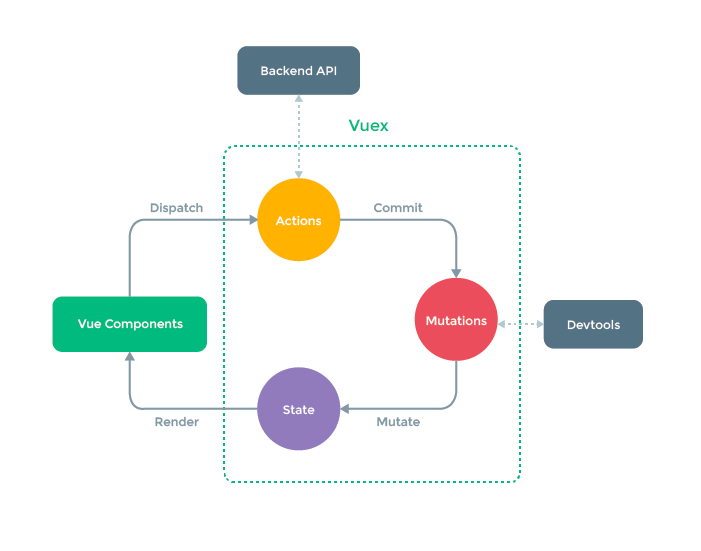

### jsonconfig.json
* @ 절대경로 단축키 등록 빌드 등록 빌등 exlude 등록
---
### eslintrc.js
* prettier와 같이 있음 rules : []

---
### vue .env
1. .env  , .env.development , .env.production 3가지를 지원한다.
   1. localhost 빌드시 .dev elopment 사용 npm run build 후 사용시 production사용 두 env파일내에 값이 없을때 .env파일을 사용하게 된다.
2. VUE_APP_API_URL = http://localhost:3000/ VUE_APP 접미사를 붙이면 vue 프로젝트 내에서 자동으로 .env파일을 로드해준다.
   ~~~
   const instance = axios.create({
   baseURL: process.env.API_URL, // .env파일 내에 VUE_APP이라 작성한다면 자동으로 env 파일 내에서로드됨
   });
   ~~~

---
### axios 구조화
* src/api 안에 axios 관련 데이터를 구조화하여 사용합니다.
* axios 인스턴스를 만들어 axios 인스턴스 안에 기본 url 및 토큰등을 넣어 요청시 마다 해당값을 넣어 보낼 수 있다.
  ~~~
  const instance = axios.create({
  baseURL: process.env.VUE_APP_API_URL,
  headers: {
      Authorization: 'test1234',
    },
  });
  ~~~

---
### 개발용 라이브러리 와 배포용 라이브러리
* npm i ~~~  or npm install ~~~ --save-prod
  * 이렇게 설치된 배포용 라이브러리는 npm run build로 빌드를 하면 최종 애플리케이션 코드 안에 포함됩니다.
* npm i ~~~ -D or npm install ~~~ --save-dev
  * 설치 옵션에 -D를 주었다면 해당 라이브러리는 빌드하고 배포할 때 애플리케이션 코드에서 빠지게 됩니다. 
  * 따라서, 최종 애플리케이션에 포함되어야 하는 라이브러리는 -D로 설치하면 안 됩니다.

---
### 코드 스플리팅
* url에 맞춰 해당 컴포넌트를 들고 동적으로 들고 오는 방법
  ~~~
  routes: [
    { path: '/login', component: () => import('@/views/LoginPage') },
    { path: '/signup', component: () => import('@/views/SignupPage') },
  ],
  ~~~
  
---
### 없는 페이지 요청 접근
* router index 안 path:'*' <- 이외 모든 접근에 대하여 반응합니다.

---
### computed
* Vue data 변화시 발생하는 함수를 정의 하는곳
* v-if 등으로 html 태그에 유효성 검사등에 활용 할 수 있다.
  ~~~
  // vue 인스턴스 내부에 username이 변경될때마다 isUsernameValid 함수 실행됨
  computed: {
    isUsernameValid() {
      return validateEmail(this.username);
    },
  },
  ~~~
  
---

### router

#### Dynamic Route Matching
* 파라미터를 받아서 PATH를 정의할 수 있는 ROUTE
* 파라미터를 받는 방법 this.$route.params.파라미터명
  ~~~
  // :파라미터이름 으로 path 변수명을 받습니다.
  {
      path: '/post/:id',
      component: () => import('@/views/PostEditPage.vue'),
    }
  ~~~
#### this.$router.push('/main');
* javascript 태그 안에서 url 및 페이지 변경 object 및 파라미터를 넘길 수 있습니다.
* https://router.vuejs.org/guide/essentials/navigation.html
   ~~~
   this.$router.push('/main');
   ~~~

#### <a href = "https://router.vuejs.org/guide/advanced/navigation-guards.html">라우터 네비게이션 가드</a>
  * 특정 URL 진입전의 동작을 정의하는 속성(함수)
  * beforeEach , beforeEnter등 함수들이 존재합니다.
    ~~~
    const router = new VueRouter // 모든 라우터에 적용 예시
    // to : 이동하려는 페이지 , from : 현재 페이지 , next : 다음 페이지 호출 메서드
    // 각 router 안에 meta라는 객체를 넣어 사용 할 수 있습니다.
    {
      path: '/post/:id',
      component: () => import('@/views/PostEditPage.vue'),
      meth: { auth: true },
    },
     
    router.beforeEach((to, from, next) => {
    if (to.meta.auth && !store.getters.isLogin) {
    next('/login'); // <- to 보낼 url
    return;
    }
    next();
    });
    ~~~
---
### vuex
 
* vuex 에 구조 사진 입니다.
#### vuex 동작
1. store 내부에 actions를 이용해 백엔드에게 데이터 통신
2. commit 명령어를 화면에서 호출
3. mutations 를 통해 받은 데이터를 가공하게 됩니다.
4. 가공 후 store내에 state내 변수에 값 할당, 할당된 데이터를 vue component 화면에 보여줍니다.
#### actions
  * actions을 통해 데이터를 받은 후 mutations로 옮김 -> state로 옮김 -> vue component
  * actions에 매개변수로 context가 들어가는데 context안에 vue compositionApi 를 통해 vue 인스턴스에 접근해 mutation을 commit 명령어로 호출 할 수 있다.
    ~~~
    actions: {
    async LOGIN({ commit }, userData) {
      const { data } = await loginUser(userData);
      console.log(data.token);
      commit('setToken', data.token);
      commit('setUsername', data.user.username);
      saveAuthToCookie(data.token);
      saveUserToCookie(data.user.username);
      return data;
    },
    },
    ~~~

#### mutations
* store 내부에 존재하는 state 객체에 값을 할당 하는 변수 집합 정도 인듯합니다.
  * actions에 commit메서드를 통해 올라온 이벤트에 맞춰 데이터를 가공 후 state에 값을 넣습니다.
  ~~~
  mutations: {
    setUsername(state, username) {
      state.username = username;
    },
    clearUsername(state) {
      state.username = '';
    },
    setToken(state, token) {
      state.token = token;
    },
  },
  ~~~
#### getters
* vuex 내부에서 state에 있는 값을 가공하여 사용
~~~
state: {
    username : '',
}
,getters: {
    test(state){
        return state.username + '님';
    }
}

//component내부
<h1>{{ this.$store.getters.test }}</h1> 
~~~

#### state
* vuex 내부에 마지막 제일 중요한 component로 들어가기전 최종 데이터입니다.
* 해당 값들로 component에서 this.$store.변수명 등 getters... 등으로 호출되어 사용됩니다.
---
### 컴포넌트간 데이터 전달 방법 3가지
1. component 통신 방식 props 와 event를 이용
   * :item <- item이라는 props를 하위 컴포넌트에게 전달 할 수 있습니다. 하위에서는 event로 $emit으로 데이터를 전달합니다.
   ~~~
   // 상위 컴포넌트 :postItem PostListItem 컴포넌트에 postItem이라는 키에 props 데이터를 전달합니다.
   <PostListItem
          v-for="postItem in postItems"
          :key="postItem._id"
          :postItem="postItem"
          @refresh="fetchData"
        ></PostListItem>
   
   // 하위 컴포넌트 deleteItem이라는 이벤트를 emit으로 refresh라는 key로 상위 컴포넌트로 올립니다.
   <i class="icon ion-md-trash" @click="deleteItem"></i>

   methods: {
    async deleteItem() {
      await deletePost(this.postItem._id);
      this.$emit('refresh');
    },
   ~~~
2. event bus를 이용하여 데이터를 전달
3. vuex 이용하여 store object를 이용
   1. vuex 라이브러리를 다운받아 vue프로젝트 내에 데이터 변경을 한곳에서 관리를 할 수 있다.
   2. mutations라는 메소드를 이용해 데이터를 사용한다.
   3. this.$store.commit(메소드명 , 전달 값)을 이용해 store내부에 있는 state 안에 값이 들어온다.
   4. {{ $store.state.username }} 같이 사용하여 값을 html내부에 표기 할 수 있다.
   ~~~
   export default new Vuex.Store({
    state: {
    username: '',
    },
    getters: {
    isLogin(state) {
    return state.username !== '';
    },
    },
    mutations: {
    setUsername(state, username) {
    state.username = username;
    },
    clearUsername(state) {
    state.username = '';
    },
    },
    });
   ~~~
   5. axios 인스턴스 헤더에 token 넣기
      1. axios는 이미 생성이 된 상태이기에 interceptor를 통해 넣을 수 있다. <a href = 'https://github.com/axios/axios#interceptors'>AXIOS interceptor</a>
    
---

### <a href="https://v2.vuejs.org/v2/guide/filters.html?redirect=true#ad">vue-filter</a>
* 사용법
  ~~~
  {{ postItem.createdAt | formatDate }} // 정의된 필터 사용 createdAt 데이터가 formarDate를 통해 return된 값이 나옵니다.
    // filter 정의  
  filters: {
    formatDate(value) {
      return new Date(value);
    },
  }
  ~~~
* 전역필터 사용 main.js에 정의하여서 사용합니다.
~~~
import { formatDate } from '@/utils/filters';
Vue.filter('formatDate', formatDate); // key : value 쌍으로 정의 합니다.
// vue 파일내에서는 동일하게 {{ data | filter 키값 }} 으로 사용합니다.
~~~

--- 

### vue 메서드
1. router-link
   ~~~
    <router-link to="/signup">회원가입</router-link> // to에 있는 url이 매핑이 되면 routerView라는 위치에 html을 위치 시켜준다
    <router-view></router-view>
   ~~~
2. v-model
   * v-model이라는 속성을 사용하면 입력 값이 자동으로 뷰 데이터 속성에 연결됩니다.
   * v-bind , v-on이라는 속성과 같이 이용이 됩니다.
   ~~~~
   data() {
    return {
      username: '',
      password: '',
      nickname: '',
    };
    },
   ~~~~
   * @submit.prevent :submit 버튼에 대한 이벤트 x prevent @ v-??
3. v-bind:속성
   * v-bind를 이용해 html속성애 따라 활성화 시킬 수 있다.
   ~~~
   : <- v-bind 축약어 FALSE일때 disabled됨
   :disabled="!isUsernameValid || !password"
   ~~~
   
4. v-for
    * v-for는 vue 객체가 가지고 있는 데이터를 이용하여 반복문을 사용 할 수 있다. VUE에서 :key 값을 권장하여 유니크한 값을 넣어 줘야한다.
    * 유니크한 키값이 중복이 되게 된다면 가상 dom에서 서로 매칭되는 노드를 업데이트 하게 됩니다.
      ~~~
      <li v-for="postItem in postItems" :key="postItem._id">
             {{ postItem.title }}
           </li>
      ~~~
   
